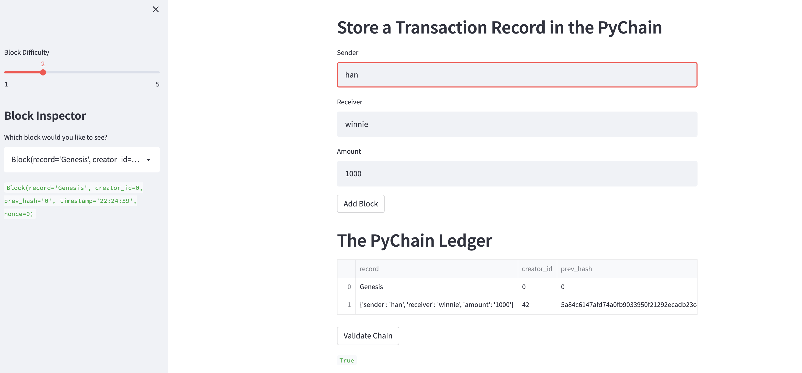

# Blockchain-based ledger system

    
I am building a blockchain-based ledger system with a user-friendly web interface.

---

## Technologies

This project leverages python 3.7. Please import: 

import streamlit as st
from dataclasses import dataclass
from datetime import datetime
from typing import Any

---

### **See the app running

---
## Contributors

Brought to you by Winnie Mei

---
## License

MIT

