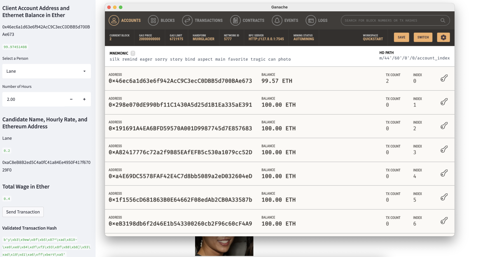

# Fintech Finder

    
I am making an the Fintech Finder, which is an application that allows customers to find fintech professionals from among a list of candidates, hire them, and pay them.

---

## Technologies

Please do the following imports.

1. import streamlit as st
2. from dataclasses import dataclass
3. from typing import Any, List
4. from web3 import Web3
5. w3 = Web3(Web3.HTTPProvider('HTTP://127.0.0.1:7545'))
6. import crypto_wallet

---

### **Running Fintech Finder**

In order to run the app, please type: streamlit run fintech_finder.py

For example, if I wanted to hire Lane for 2 hours, I should see the following:

---
## Contributors

Brought to you by Winnie Mei

---
## License

MIT

