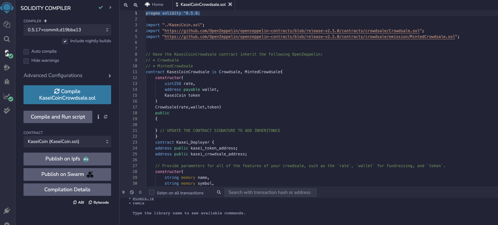
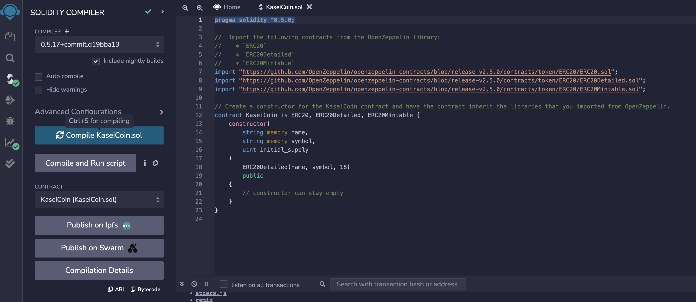
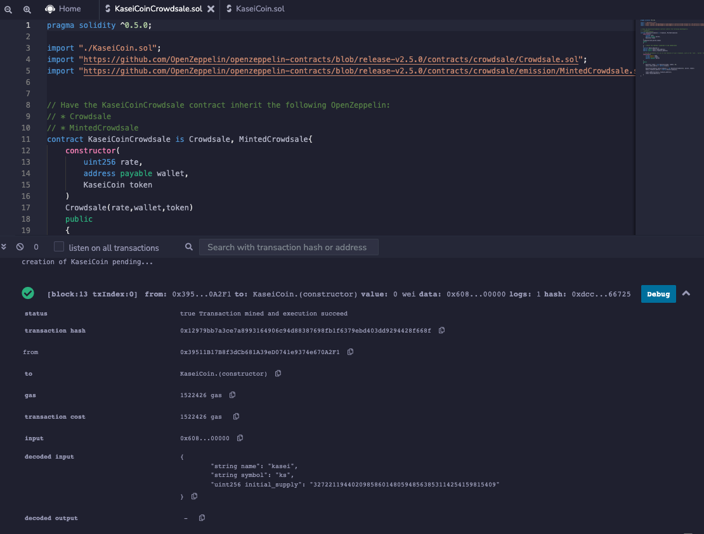
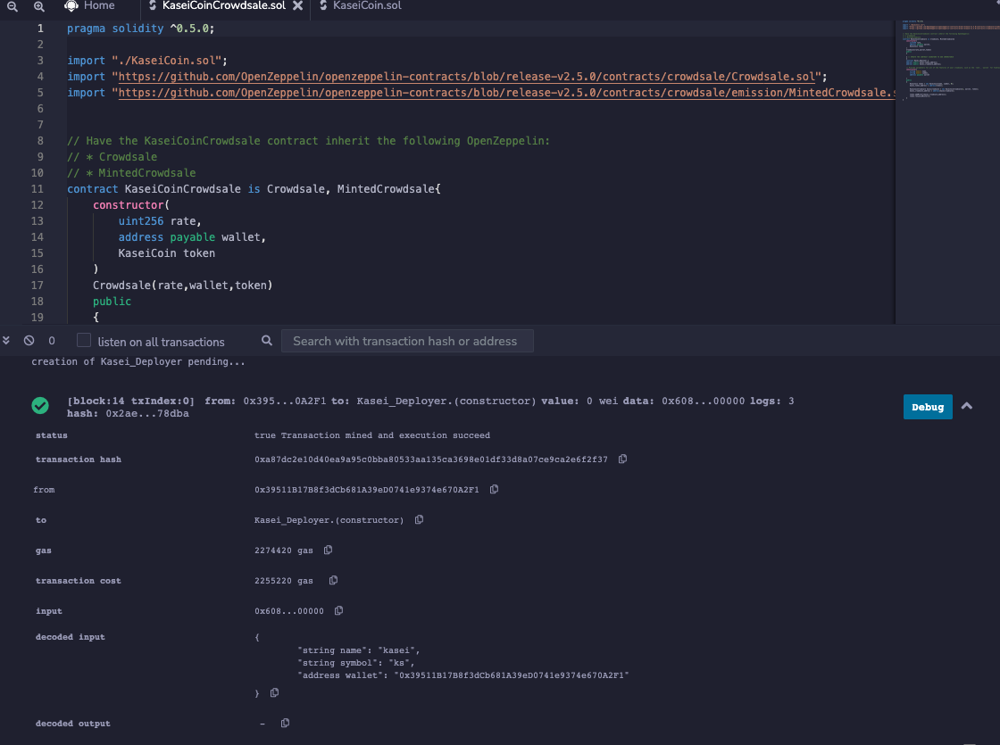
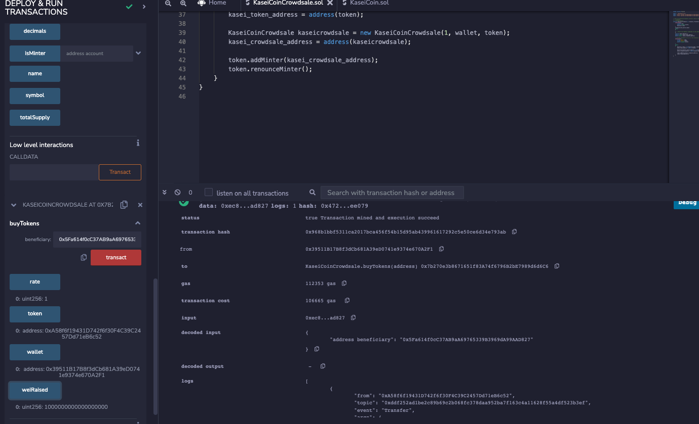

# Kaisei

    
Martian Token Crowdsale

I am creating a KaseiCoin Token Contract that is ERC-20 compliant. This will be minted by using a Crowdsale contract from the OpenZeppelin Solidity library.

---

## Technologies

Please do the following imports from the OpenZeppelin library.

1. ERC20
2. ERC20Detailed
3. ERC20Mintable

---

### ** Correctly deploying solidity**

Make sure the KaseiCoin.sol and KaseiCoinCrowdsale.sol compile. 

Please deploy the contracts.

---
## Contributors

Brought to you by Winnie Mei

---
## License

MIT

