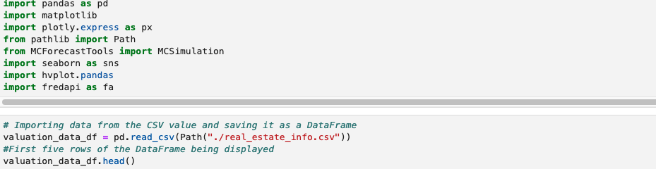
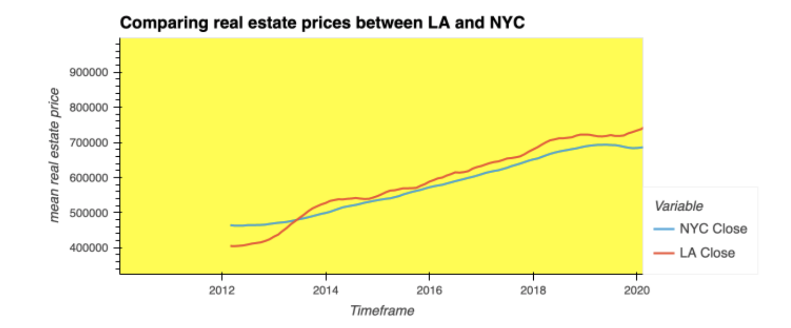
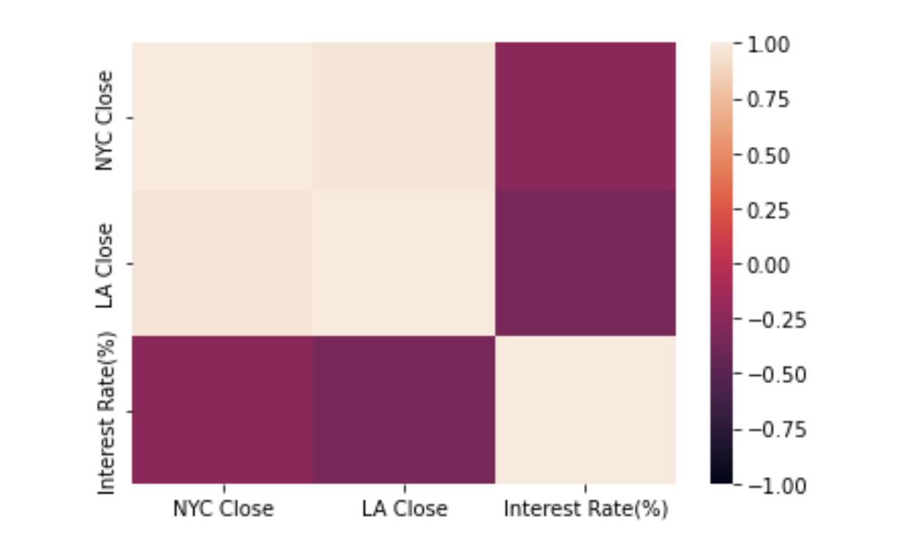
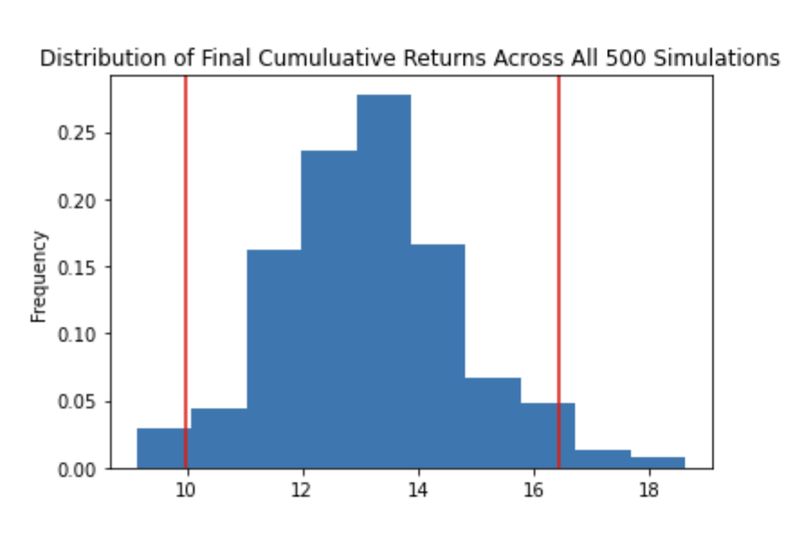
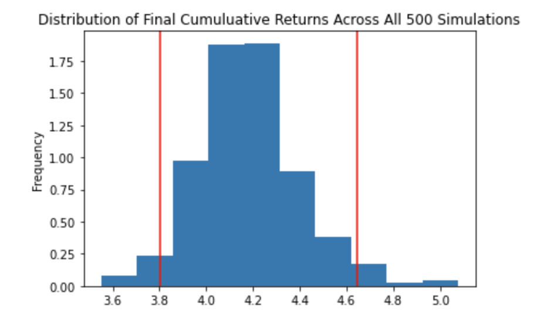

# NYC-PropTech-Prices

<font color='red'>
This repo contains the results of the NYC-PropTech-Prices group project. 
<br />
<p>
    
    
To view the file, open the "NYC-PropTech-Prices" folder and open the "evaluations.ipynb" file. 
</p>

    
Our team assumed the role of analysts at a Proptech Company that provides data on the residential real estate markets in both New York City and Los Angeles. Our goal was to compare both markets and understand if there is a correlation among the residential real estate prices in both cities and national mortgage rates. To do so, we used aggregation, visualization, and predictive analysis techniques to determine past trends and make forecasts. We created a Jupyter notebook that contains our analysis. The analysis is complete with professionally styled and formatted interactive visualizations. 
    
Our main task was to visualize and analyze the real-estate data in the Jupyter notebook by:
  * Importing and plotting the median housing prices in both markets
  * Importing and plotting the national mortgage rates
  * Comparing the average prices with national mortgage rates
  * Running monte carlo simulations to provide pricing forecasts
  * Coming to a conclusion on any trends or patterns spotted.
</font>

---

## Installation Guide

First, installed the following libraries and APIs into our development environment: 
(1) hvplot, (2) fredapi, (3) Matplotlib, (4)MCsimulation, (5)Json, (6)Plotly, (7)seaborn. 

In the workbook, we also used the read_csv function and Path module, to create a DataFrame by importing the home.csv file from Zillow, which contained the real estate pricing data. The fredapi package allowed us to import the mortgage interest data used in our analysis. 





---

## Technologies

This project leverages python 3.7 with the following libraries and dependencies:

* [pandas](https://github.com/pandas-dev/pandas) - For manipulating data

* [hvplot](https://github.com/holoviz/hvplot) - High-level plotting API for the PyData ecosystem built on HoloViews

* [fredapi](https://github.com/mortada/fredapi) - Python API for the FRED data provided by the Federal Reserve Bank of St. Louis


---

### **Analysis of NYC and LA Real Estate Prices**

First, we began by cleaning the data imported from Zillow via a csv. Then we used numerical and visual aggregation to demonstrate the historical trend in real estate prices for each city. 

(1) Imported `home.csv` into a new data frame.

(2) Created separate data frames that focused on NY and LA.

```python
nyc_df = valuation_data_df[valuation_data_df['RegionName']=="New York"]
la_df = valuation_data_df[valuation_data_df['RegionName']=="Los Angeles"]
```

(3) Used `melt` function to re-arrange or transpose organization of data to a format more suitable for analysis.

```python
nyc = pd.melt(nyc_df, id_vars = ['RegionID', 'SizeRank', 'RegionName', 'RegionType', 'StateName',
       'State', 'Metro', 'CountyName'])

nyc['variable']= pd.to_datetime(nyc['variable'], infer_datetime_format = True)

nyc.set_index('variable', inplace=True)

nyc = nyc.loc['2012-01-31':]
nyc = nyc.drop(columns= ['RegionID', 'SizeRank', 'RegionName', 'RegionType', 'StateName',
       'State', 'Metro', 'CountyName'])
nyc=nyc.rename(columns={'value':'nyc close'})
nyc.index.names = ['Date']

nyc['change']= nyc.pct_change().dropna()
nyc
```

(4) Combined each of the new dataframes for each city.

```python
combo= pd.concat([nyc,la],keys=["NYC","LA"], axis="columns", sort =False).dropna()
real_estate_returns= combo.pct_change().dropna()
combo1 = pd.concat([nyc,la],axis="columns", sort =False).dropna()

combo
```

(5) Plotted the real esate prices for each city in a line chart.

### **Analysis of National Mortgage Rates**

Here, we used the Fred API to import the mortgage rate data. Federal Reserve Economic Data ("FRED") is a database maintained by the Research division of the Federal Reserve Bank of St. Louis that has more than 816,000 economic time series from various sources.

(1) Imported the data into to the `mortgages_df` dataframe. 

(2) Plotted the historical trend of interest rates in a `hvplot` line chart.

### **Comparison of Real Estate Prices and National Mortgage Rates**

In this section, we used the `corr` function and other the 'XXXXX' library to explore the correlation between real estate prices and mortgage rates.

(1) Visually compared real estate prices and mortgage rates.



(2) Calculated the correlation among real estate prices in NY, LA, and national mortgage rates.



### **Monte Carlo Forecast of Future Real Estate Prices**

For this part of the assignment, we attempted to forecast the median prices for real estate prices in NY and LA. 

(1) Ran a monte carlo simulation for real estate prices in LA.



(2) Ran a monte carlo simulation real estate prices in NY.



### **Conclusions**

Based on our analysis, we came to the following conclusions:

(A) LA real estate prices are increasing at a higher rate than NY (Queens County) real estate prices.

(B) Real estate prices are inversely correlated with mortgage rates.

(C) Invest in real estate because returns are extremely positive.
       
       There is a 95% chance that the LA median home value over the next thirty years will be within the range of $4,990,809.80 and $8,224,836.22.

       There is a 95% chance that the NY median home value over the next thirty years will be within the range of $1,901,451.6 and $2,323,568.72.

       If we invest $500K in LA real estate now, we predict a 1215.7% return on investment in 30 years.

       If we invest $500k in NY (Queens County) real estate now, we predict a 318.6% return on investment in 30 years.

---
## Contributors

Brought to you by Winnie Mei, Babin Shrestha, Matthew Field, Feier Ou, and Wilson Rosa 

---
## License

MIT

